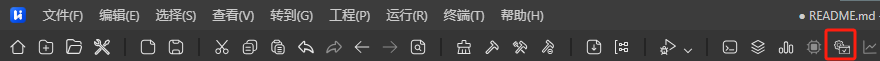

# hi3863_demo
## 示例介绍
| 名称 | 描述 |
| ----------- | ----------- |
| mqtt3_client_demo | 通过WIFI连接上路由器，并与自己搭建的EMQX服务器建立MQTT V3.1.1 TCP连接 |
| mqtt5_client_demo | 通过WIFI连接上路由器，并与自己搭建的EMQX服务器建立MQTT V5.0 TCP连接 |
| http_server_demo | 通过WIFI连接上路由器，绑定IP和端口，通过浏览器访问HTTP SERVER |
| http_client_demo | 通过WIFI连接上路由器，通过HTTP GET百度网页数据 |
| fix_sta_sample | 将原来的轮询代码修改为事件通知形式以实现重复多次连接 |
| blufi_demo | 移植乐鑫BLUFI项目代码，通过EspBlufi APP配网（未完成） |
## Quick Start
### 1、上层Kconfig文件添加如下代码
```
config ENABLE_DEMO_SAMPLE
    bool
    prompt "Enable the Sample of demo."
    default n
    depends on SAMPLE_ENABLE
    help
        This option means enable the sample of demo.

if ENABLE_DEMO_SAMPLE
osource "application/samples/nearlink_ws63_demo/Kconfig"
endif
```
### 2、上层CMakeLists.txt文件添加如下代码
```
if(DEFINED CONFIG_ENABLE_DEMO_SAMPLE)
    add_subdirectory_if_exist(nearlink_ws63_demo)
endif()
```
### 3、进入系统配置界面

### 4、依次进入路径Application->Enable Sample->Enable the Sample of Demo即可看到文档中的所有例程
## 联系
### 如果有想要的其他demo欢迎提ISSUES
